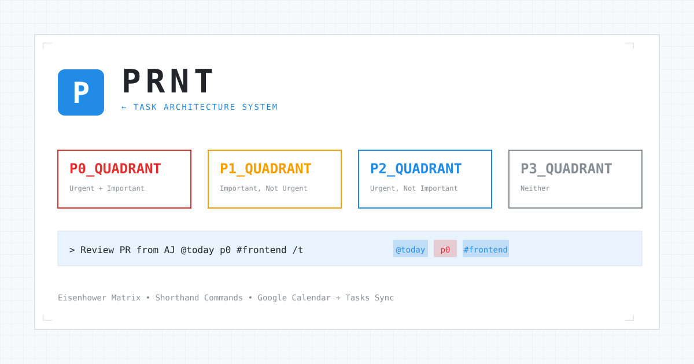

# PRNT — Task Architecture System

A Blueprint-styled personal productivity application featuring an Eisenhower matrix, powerful shorthand commands, and optional Google Calendar & Tasks integration. Built for Cloudflare Pages.



## ✨ Features

- **Eisenhower Matrix** — Visual 4-quadrant prioritization (P0-P3)
- **Shorthand Commands** — Rapid task entry with `@today p0 #work`
- **Multiple Views** — Matrix, List, Notes, and Wrapped (analytics)
- **Google Integration** — Optional Calendar reminders and Tasks sync
- **Dark/Light Themes** — Blueprint-inspired aesthetic
- **Type-ahead Suggestions** — Smart autocomplete as you type
- **Keyboard Shortcuts** — `Cmd+K` to focus, `Cmd+1-4` to switch views
- **External Inputs** — API for Raycast, iOS Shortcuts, Email

## 🚀 Quick Deploy

### 1. Create Database

```bash
# Install Wrangler CLI
npm install -g wrangler

# Login to Cloudflare
wrangler login

# Create D1 database
npx wrangler d1 create prnt-db
```

Copy the `database_id` from the output.

### 2. Configure Project

Update `wrangler.toml` with your database ID:

```toml
[[d1_databases]]
binding = "DB"
database_name = "prnt-db"
database_id = "YOUR_DATABASE_ID_HERE"
```

### 3. Initialize Database

```bash
npx wrangler d1 execute prnt-db --file=./schema.sql
```

### 4. Deploy

```bash
npm install
npx wrangler pages deploy ./
```

Your PRNT instance is now live! 🎉

## 📖 Shorthand Reference

### Priority Levels
| Command | Quadrant |
|---------|----------|
| `p0` | Urgent + Important (do first) |
| `p1` | Important, not urgent (schedule) |
| `p2` | Urgent, not important (delegate) |
| `p3` | Neither (consider dropping) |

### Due Dates
| Command | Effect |
|---------|--------|
| `@today` | Due today |
| `@eod` | End of day (6 PM) |
| `@tomorrow` / `@tmrw` | Due tomorrow |
| `@friday` / `@eow` | End of week |
| `@jan-25` | Specific date |

### Tags & Types
| Command | Effect |
|---------|--------|
| `#work` | Add tag |
| `#project #urgent` | Multiple tags |
| `/t` | Force as task |

### Markdown
| Syntax | Effect |
|--------|--------|
| `**bold**` | **Bold** |
| `*italic*` | *Italic* |
| `` `code` `` | `Inline code` |
| `[text](url)` | Hyperlink |

### Examples

```
Review PR from Alex @today p0 #frontend
```
→ P0 task, due today, tagged #frontend

```
Plan Q2 roadmap @friday p1 #planning #strategy  
```
→ P1 task, due Friday, two tags

```
Ideas for the new feature #ideas
```
→ Note (no priority/date = note, not task)

## ⌨️ Keyboard Shortcuts

| Shortcut | Action |
|----------|--------|
| `Cmd/Ctrl + K` | Focus input |
| `Cmd/Ctrl + 1` | Matrix view |
| `Cmd/Ctrl + 2` | List view |
| `Cmd/Ctrl + 3` | Notes view |
| `Cmd/Ctrl + 4` | Wrapped view |
| `Enter` | Submit item |
| `Shift + Enter` | New line |
| `↑ / ↓` | Navigate suggestions |
| `Tab` | Accept suggestion |
| `Escape` | Close modal/suggestions |

## 🔗 Google Integration (Optional)

Connect Google to automatically create:
- Calendar events with reminders at 10 AM and due time
- Tasks in a "PRNT" task list

### Setup

1. **Create Google Cloud Project**
   - Go to [Google Cloud Console](https://console.cloud.google.com/)
   - Create a new project
   - Enable **Google Calendar API** and **Google Tasks API**

2. **Create OAuth Credentials**
   - APIs & Services → Credentials → Create OAuth Client ID
   - Application type: Web application
   - Authorized redirect URI: `https://YOUR-DOMAIN/api/auth/google/callback`

3. **Add Environment Variables**
   
   In Cloudflare Dashboard → Pages → Your Project → Settings → Environment variables:
   
   ```
   GOOGLE_CLIENT_ID = your-client-id
   GOOGLE_CLIENT_SECRET = your-client-secret
   ```

4. **Connect**
   
   Click the Google status indicator in PRNT to authorize.

## 🔌 External Integrations

### API Key Setup

Generate and configure an API key for external integrations:

```bash
# Generate a secure key
openssl rand -hex 32
```

Add to Cloudflare environment variables:
```
PRNT_API_KEY = your-generated-key
```

### API Usage

```bash
curl -X POST https://YOUR-DOMAIN/api/ingest \
  -H "Content-Type: application/json" \
  -H "X-API-Key: YOUR_API_KEY" \
  -d '{"text": "Review docs @tomorrow p1 #work", "source": "curl"}'
```

### Raycast Extension

See `extensions/raycast/` for a Raycast extension to add items quickly.

### iOS Shortcuts

Create a shortcut with:
1. **Get Contents of URL** action
2. URL: `https://YOUR-DOMAIN/api/ingest`
3. Method: POST
4. Headers: `X-API-Key: YOUR_KEY`
5. Body: `{"text": "[input]", "source": "ios-shortcut"}`

## 🤖 AI Summaries (Optional)

Enable AI-powered weekly summaries by adding your Anthropic API key:

```
ANTHROPIC_API_KEY = your-anthropic-key
```

Get a key at [console.anthropic.com](https://console.anthropic.com/)

## 🔒 Security Model

PRNT is designed as a **personal, single-user application**. Each deployment is:
- Isolated to one Cloudflare account
- Uses a personal D1 database
- Protected by Cloudflare's infrastructure

### What's Protected
| Endpoint | Protection |
|----------|------------|
| `/api/ingest` | API key required |
| Google tokens | Server-side only, never exposed |
| All data | Encrypted at rest (Cloudflare D1) |

### What's NOT Protected
| Endpoint | Note |
|----------|------|
| `/api/items` | No auth (by design, for simplicity) |
| Your URL | Anyone with URL can access |

### Recommendations

1. **Use a non-guessable subdomain** (e.g., `myprnt-x7k2m.pages.dev`)
2. **Enable Cloudflare Access** for additional auth layer
3. **Never share your `PRNT_API_KEY`**
4. **Rotate API keys periodically**

## 🛠️ Development

### Local Development

```bash
# Install dependencies
npm install

# Start dev server (uses local D1)
npm run dev
```

### Project Structure

```
prnt/
├── index.html              # Frontend (single-file app)
├── schema.sql              # Database schema
├── wrangler.toml           # Cloudflare config
├── functions/
│   └── api/
│       ├── _google.js      # Google API utilities
│       ├── items.js        # CRUD for items
│       ├── items/
│       │   └── [id].js     # Single item operations
│       ├── ingest.js       # External API endpoint
│       ├── summary.js      # AI summary generation
│       └── auth/
│           └── google/     # OAuth flow
└── .github/
    └── ISSUE_TEMPLATE/     # Issue templates
```

## 🎨 Customization

### Timezone

The default timezone is `Europe/Lisbon`. To change it, search for `Europe/Lisbon` in `index.html` and `ingest.js` and replace with your timezone.

### Colors

Edit CSS variables in `index.html`:

```css
:root {
  --accent-color: #228be6;    /* Primary blue */
  --priority-p0: #e03131;     /* Red */
  --priority-p1: #f59f00;     /* Orange */
  --priority-p2: #228be6;     /* Blue */
  --priority-p3: #868e96;     /* Gray */
}
```

## 📄 License

MIT License - see [LICENSE](LICENSE)

## 🤝 Contributing

Contributions welcome! See [CONTRIBUTING.md](CONTRIBUTING.md)

---

Built with ☕ and deployed on [Cloudflare Pages](https://pages.cloudflare.com/)
